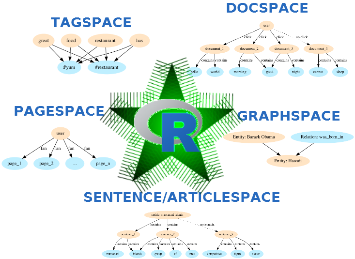

# ruimtehol: R package to Embed All the Things! using StarSpace

This repository contains an R package which wraps the StarSpace C++ library (https://github.com/facebookresearch/StarSpace), allowing the following:

- Text classification
- Learning word, sentence or document level embeddings
- Finding sentence or document similarity
- Ranking web documents
- Content-based recommendation (e.g. recommend text/music based on the content)
- Collaborative filtering based recommendation (e.g. recommend text/music based on interest)
- Identification of entity relationships




## Installation

- For regular users, install the package from your local CRAN mirror `install.packages("ruimtehol")`
- For installing the development version of this package: `devtools::install_github("bnosac/ruimtehol", build_vignettes = TRUE)`

Look to the vignette and the documentation of the functions

```
vignette("ground-control-to-ruimtehol", package = "ruimtehol")
help(package = "ruimtehol")
```


## Main functionalities

This R package allows to *Build Starspace models* on your own text / *Get embeddings* of words/ngrams/sentences/documents/labels / Get *predictions* from a model (e.g. classification / ranking) / Get *nearest neighbours similarity*

The following functions are made available.

| Function                      | Functionality                                                  |
|-------------------------------|----------------------------------------------------------------|
| `starspace`                   | Low-level interface to build a Starspace model                 |
| `starspace_load_model`        | Load a pre-trained model or a tab-separated file               |
| `starspace_save_model`        | Save a Starspace model                                         |
| `starspace_embedding`         | Get embeddings of documents/words/ngrams/labels                |
| `starspace_knn`               | Find k-nearest neighbouring information for new text           |
| `starspace_dictonary`         | Get words/labels part of the model dictionary                  |
| `predict.textspace`           | Get predictions along a Starspace model                        |
| `as.matrix`                   | Get words and label embeddings                                 |
| `embedding_similarity`        | Cosine/dot product similarity between embeddings - top-n most similar text                  |
| `embed_wordspace`             | Build a Starspace model which calculates word/ngram embeddings                              |
| `embed_sentencespace`         | Build a Starspace model which calculates sentence embeddings                                |
| `embed_articlespace`          | Build a Starspace model for embedding articles - sentence-article similarities              |
| `embed_tagspace`              | Build a Starspace model for multi-label classification                                      |
| `embed_docspace`              | Build a Starspace model for content-based recommendation                                    |
| `embed_pagespace`             | Build a Starspace model for interest-based recommendation                                   |
| `embed_entityrelationspace`   | Build a Starspace model for entity relationship completion                                  |


## Example


### Short example showing word embeddings


```r
library(ruimtehol)
set.seed(123456789)

## Get some training data
download.file("https://s3.amazonaws.com/fair-data/starspace/wikipedia_train250k.tgz", "wikipedia_train250k.tgz")
x <- readLines("wikipedia_train250k.tgz", encoding = "UTF-8")
x <- x[-c(1:9)]
x <- x[sample(x = length(x), size = 10000)]
writeLines(text = x, sep = "\n", con = "wikipedia_train10k.txt")
```

```r
## Train
set.seed(123456789)
model <- starspace(file = "wikipedia_train10k.txt", fileFormat = "labelDoc", dim = 10, trainMode = 3)
model

Object of class textspace
 dimension of the embedding: 10
 training arguments:
      loss: hinge
      margin: 0.05
      similarity: cosine
      epoch: 5
      adagrad: TRUE
      lr: 0.01
      termLr: 1e-09
      norm: 1
      maxNegSamples: 10
      negSearchLimit: 50
      p: 0.5
      shareEmb: TRUE
      ws: 5
      dropoutLHS: 0
      dropoutRHS: 0
      initRandSd: 0.001
```

```r
embedding <- as.matrix(model)
embedding[c("school", "house"), ]

              [,1]         [,2]        [,3]        [,4]         [,5]        [,6]       [,7]       [,8]         [,9]       [,10]
school 0.008395348  0.002858619 0.004770191 -0.03791502 -0.016193179 0.008368539 -0.0221493 0.01587386 -0.002012054 0.029385706
house  0.005371093 -0.007831781 0.010563998  0.01040361  0.000616577 0.005770847 -0.0097075 0.01678141 -0.004738560 0.009139475
dictionary <- starspace_dictionary(model)
```

```r
## Save trained model as a binary file or as TSV so that you can inspect the embeddings e.g. with data.table::fread("wikipedia_embeddings.tsv")
starspace_save_model(model, file = "textspace.ruimtehol",      method = "ruimtehol")
starspace_save_model(model, file = "wikipedia_embeddings.tsv", method = "tsv-data.table")
## Load a pre-trained model or pre-trained embeddings
model <- starspace_load_model("textspace.ruimtehol",      method = "ruimtehol")
model <- starspace_load_model("wikipedia_embeddings.tsv", method = "tsv-data.table", trainMode = 3)

## Get the document embedding
starspace_embedding(model, "get the embedding of a full document")

                                          [,1]        [,2]      [,3]       [,4]      [,5]      [,6]       [,7]      [,8]     [,9]     [,10]
get the embedding of a full document 0.1489144 -0.09543591 0.1242385 -0.1080941 0.6971645 0.3131362 -0.3405705 0.3293449 0.231894 -0.281555
```

The following functionalities do similar things. They see what is the closest word or sentence to a provided sentence.

```r
## What is closest term from the dictionary
starspace_knn(model, "What does this bunch of text look like", k = 10)

## What is closest sentence to vector of sentences
predict(model, newdata = "what does this bunch of text look like", 
        basedoc = c("what does this bunch of text look like", 
                    "word abracadabra was not part of the dictionary", 
                    "give me back my mojo",
                    "cosine distance is what i show"))
                    
## Get cosine distance between 2 sentence vectors
embedding_similarity(
  starspace_embedding(model, "what does this bunch of text look like"),
  starspace_embedding(model, "word abracadabra was not part of the dictionary"), 
  type = "cosine")
```

### Short example showing classification modelling (tagspace)


Below Starspace is used for classification

```r
library(ruimtehol)
data("dekamer", package = "ruimtehol")
dekamer$x <- strsplit(dekamer$question, "\\W")
dekamer$x <- sapply(dekamer$x, FUN = function(x) paste(setdiff(x, ""), collapse = " "))
dekamer$x <- tolower(dekamer$x)
dekamer$y <- strsplit(dekamer$question_theme, split = ",")
dekamer$y <- lapply(dekamer$y, FUN=function(x) gsub(" ", "-", x))

set.seed(123456789)
model <- embed_tagspace(x = dekamer$x, y = dekamer$y,
                        dim = 50, 
                        lr = 0.01, epoch = 40, loss = "softmax", adagrad = TRUE, 
                        similarity = "cosine", negSearchLimit = 50,
                        ngrams = 2, minCount = 2)
plot(model)                        
            
text <- c("de nmbs heeft het treinaanbod uitgebreid via onteigening ...",
          "de migranten komen naar europa de asielcentra ...")                   
predict(model, text, k = 3)  
predict(model, "koning filip", k = 10, type = "knn")
predict(model, "koning filip", k = 10, type = "embedding")
```

## Notes

- Why did you call the package ruimtehol? Because that is the translation of StarSpace in WestVlaams.
- The R wrapper is distributed under the Mozilla Public License 2.0. The package contains a copy of the StarSpace C++ code (namely all code under src/Starspace) which has a BSD license (which is available in file LICENSE.notes) and also has an accompanying PATENTS file which you can inspect [here](inst/PATENTS).

## Support in text mining

Need support in text mining?
Contact BNOSAC: http://www.bnosac.be
